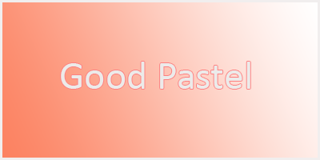

# good-pastel.github.io

> [[good-pastel](https://good-pastel.github.io)]

[![LinkedIn][linkedin-shield]][linkedin-url]

 

  

  <h3 align="center">Welcome to Good Pastel</h3>

  

   <blockquote><i>"Colors fade, but pastels hold their magic forever. Let the pastels be a reflection of the beauty within your soul."</i></blockquote>
    
    <a href="https://github.com/good-pastel?tab=repositories"><strong>Explore the other Repo»</strong></a>
  

---

## Description

This is my personal portfolio.

## Language

 
 
 
&copy Good Pastel. 2024

<!-- MARKDOWN LINKS & IMAGES -->

[linkedin-shield]: https://img.shields.io/badge/-LinkedIn-black.svg?style=for-the-badge&logo=linkedin&colorB=555
[linkedin-url]: https://linkedin.com/in/deviyool
